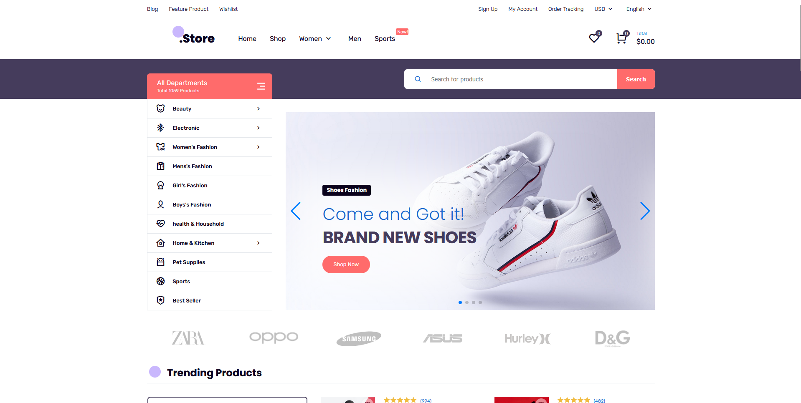
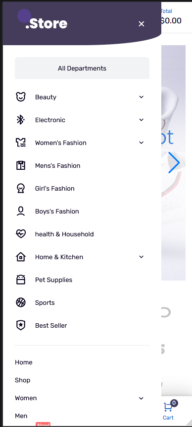

# Alpha eCommerce Demo

A fully responsive eCommerce website clone built using **HTML, CSS, and JavaScript**. This project demonstrates a modern and visually appealing eCommerce layout with interactive features.

## 🚀 Live Demo

🔗 [Alpha eCommerce Demo](https://alpha-ecommerce-demo.netlify.app/)

## 📌 Features

- 📱 Fully responsive design for all screen sizes
- 🎨 Modern and clean UI/UX
- 🛒 Interactive shopping cart (frontend only)
- 🔍 Product listing and filtering
- 📌 Navbar with dropdown menu
- 🎭 Smooth animations and transitions

## 📷 Screenshots

) 



## 🛠️ Technologies Used

- **HTML** - Structuring the layout
- **CSS** - Styling and responsiveness
- **JavaScript** - Adding interactivity

## 📂 Project Structure

```
alpha-ecommerce-demo/
│-- index.html
│-- style.css
│-- script.js
│-- assets/
│   ├── images/
│   ├── icons/
│   ├── fonts/
```

## 🔧 Setup & Installation

1. Clone the repository:
   ```sh
   git clone https://github.com/abidsarkar/Ecommerce-Website-Alpha-Responsive
   ```
2. Open `index.html` in a browser.

## 🌟 Contributing

Feel free to fork this repository and improve the project. If you find any issues, open an issue or submit a pull request.

## 📜 License

This project is open-source and available under the MIT License.

---
💡 *Developed by [MD Abid Sarkar](https://www.linkedin.com/in/md-abid-sarkar-556903290/).*
